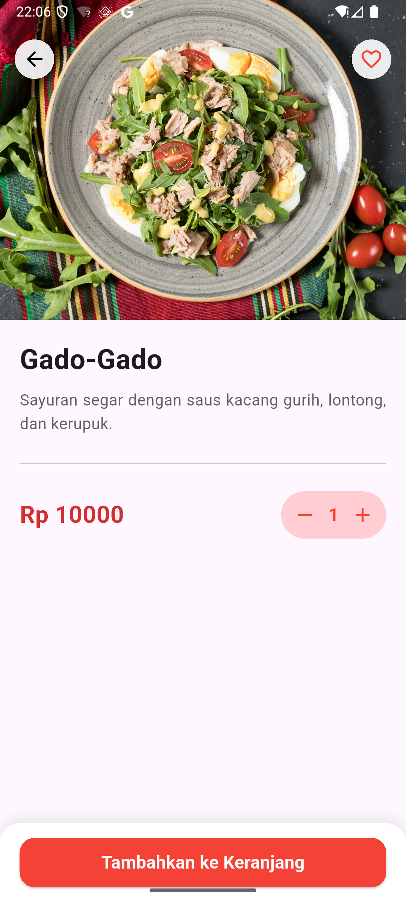

# Kanhas - Aplikasi Smart Canteen 📱

<p align="center">
  
</p>



**Kanhas** adalah aplikasi pemesanan kantin (Canteen Ordering) berbasis Flutter yang dirancang untuk mendigitalisasi sistem pemesanan makanan di lingkungan kampus. Proyek ini dibangun sebagai solusi untuk memecahkan masalah antrean manual, memungkinkan mahasiswa memesan makanan dengan cepat dan efisien.

Aplikasi ini telah dikembangkan lebih lanjut dengan fitur **Full Local Persistence**, **Complex State Management**, dan pemisahan peran pengguna (**Role-Based Access**) antara Mahasiswa dan Admin.

---

## 🚀 Fitur Unggulan

Aplikasi ini membedakan fitur berdasarkan dua peran pengguna:

### 👨‍🎓 Fitur Mahasiswa (User)
* **Persistent Login:** Sesi login disimpan secara lokal, pengguna tidak perlu login ulang setiap kali membuka aplikasi.
* **Smart Cart System:** Keranjang belanja yang interaktif dengan kalkulasi harga otomatis.
* **Order History:** Melacak riwayat pesanan yang pernah dilakukan (Data tersimpan permanen di perangkat).
* **Jelajah Menu:** Pencarian menu canggih dengan filter kategori (Makanan Berat, Minuman, Snack).
* **Profil Kompleks:** Kemampuan mengedit info profil, mengganti foto profil (dari galeri), dan mengubah password dengan validasi keamanan.

### 🛡️ Fitur Admin
* **Manajemen Penuh (CRUD):** Kemampuan untuk Menambah, Mengedit, dan Menghapus data Kantin serta Menu Makanan.
* **Unggah Gambar Lokal:** Mendukung pengambilan gambar menu/kantin langsung dari galeri perangkat.
* **Auto-Save Data:** Setiap perubahan data menu atau kantin otomatis tersimpan ke memori perangkat (`Shared Preferences`), sehingga data tidak hilang saat aplikasi ditutup.

---

## 🛠️ Arsitektur & Teknologi

Proyek ini dibangun menggunakan standar pengembangan modern:

| Komponen | Teknologi/Library | Deskripsi |
| :--- | :--- | :--- |
| **Framework** | Flutter 3.x | UI Toolkit & Bahasa Pemrograman (Dart) |
| **State Management** | Provider | Menggunakan `MultiProvider` untuk manajemen state global (Auth, Cart, Canteen, History) |
| **Local Storage** | Shared Preferences | Menyimpan data User, Menu, dan Riwayat Pesanan secara permanen (JSON Serialization) |
| **Image Handling** | Image Picker & Path Provider | Manajemen file gambar lokal dari galeri |
| **UI/UX** | Material 3 | Desain modern dengan `SliverAppBar`, `Hero Animation`, dan `SnackBar` floting |

---

## 🏃 Cara Menjalankan Proyek

1.  Pastikan Anda memiliki Flutter SDK yang terinstal.
2.  Clone repositori ini:
    ```bash
    git clone [URL_GITHUB_ANDA]
    ```
3.  Masuk ke direktori proyek:
    ```bash
    cd kanhas
    ```
4.  Unduh *dependencies*:
    ```bash
    flutter pub get
    ```
5.  Jalankan aplikasi:
    ```bash
    flutter run
    ```

### 🔐 Akun Demo

Aplikasi ini dilengkapi dengan data akun bawaan untuk pengujian instan:

* **Role Admin:**
  * **Username:** `admin`
  * **Password:** `admin123`

* **Role Mahasiswa:**
  * **Username:** `mahasiswa`
  * **Password:** `siswa123`

* Atau **buat akun baru** melalui halaman Registrasi (Data akun baru juga akan tersimpan permanen).

---

## 💡 Pembelajaran Utama (Key Takeaways)

Dalam pengembangan **Kanhas**, fokus teknis utama meliputi:
1.  **Data Persistence Strategy:** Mengimplementasikan logika serialisasi JSON (`toMap`/`fromMap`) untuk menyimpan objek kompleks ke dalam penyimpanan lokal.
2.  **State Management:** Pemisahan logika bisnis dari UI menggunakan `Provider` untuk performa aplikasi yang reaktif.
3.  **Clean Architecture:** Struktur kode yang terorganisir memisahkan Model, View (Screens), dan ViewModel (Providers).

---